# AutoDiagnose AI

### Full-Stack Automotive Diagnostic Platform

AutoDiagnose AI is a full-stack automotive diagnostic platform designed to transform vehicle information, reported symptoms, OBD-II / DTC codes and adaptive answers into a structured diagnostic workflow.

The project combines automotive diagnostic logic, modern web development, backend API architecture, PostgreSQL persistence, authentication, explainable scoring and AI-ready diagnostic processing in a production-deployed application.

<p align="center">
  <a href="https://autodiagnose-ai-phi.vercel.app">
    <strong>Live Application</strong>
  </a>
  ·
  <a href="https://autodiagnose-ai-api.onrender.com/docs">
    <strong>API Documentation</strong>
  </a>
</p>

<p align="center">
  
</p>

---

## Overview

AutoDiagnose AI was built as an end-to-end software engineering project rather than a static UI prototype.

The application guides the user through a complete diagnostic workflow:

```text
Vehicle identification
        ↓
Symptom collection
        ↓
OBD-II / DTC evidence
        ↓
Adaptive questions
        ↓
Case verification
        ↓
Diagnostic analysis
        ↓
Ranked hypotheses
        ↓
Recommended checks
        ↓
Technical basis
        ↓
Diagnostic report
        ↓
Persistent history
```

The platform is available in both English and Romanian and can be used directly in the browser or installed as a Progressive Web App.

---

# Live Demo

### Frontend

```text
https://autodiagnose-ai-phi.vercel.app
```

### FastAPI documentation

```text
https://autodiagnose-ai-api.onrender.com/docs
```

> The backend currently runs on a free Render instance. The first request after a period of inactivity may take longer while the service wakes up.

---

# Application Preview

## Product onboarding

The application begins with language selection before entering the main workflow.

<p align="center">
  
</p>

The platform also includes privacy-oriented cookie controls from the first interaction.

<p align="center">
  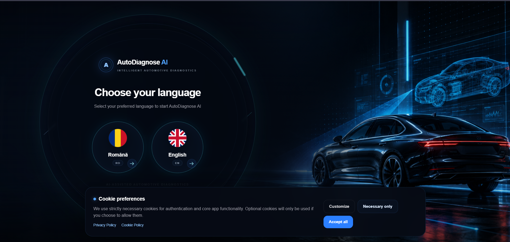
</p>

---

## Welcome experience

The public landing screen provides access to authentication, guest mode and the diagnostic workflow.

<p align="center">
  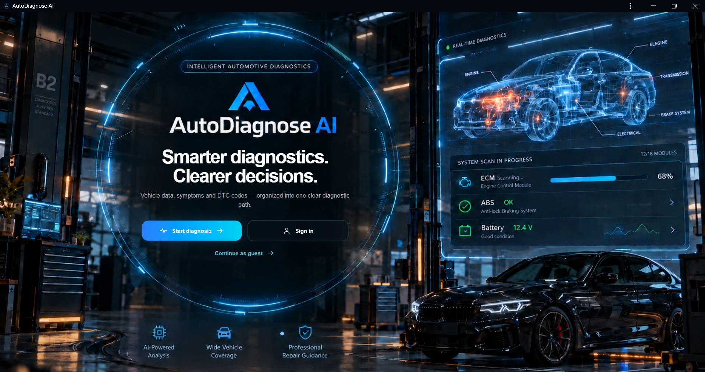
</p>

---

## Authentication

Users can create an account and authenticate to access persistent diagnostic history and personal data controls.

<p align="center">
  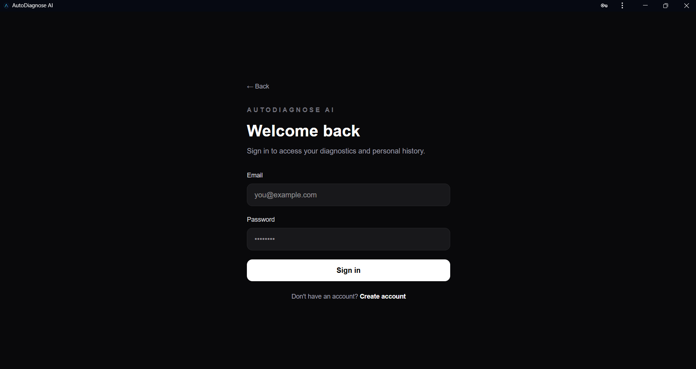
</p>

---

# Dashboard

The authenticated dashboard provides access to diagnostics, history, settings and diagnostic guidance.

It also includes a visual diagnostic-system overview and user-specific activity information.

<p align="center">
  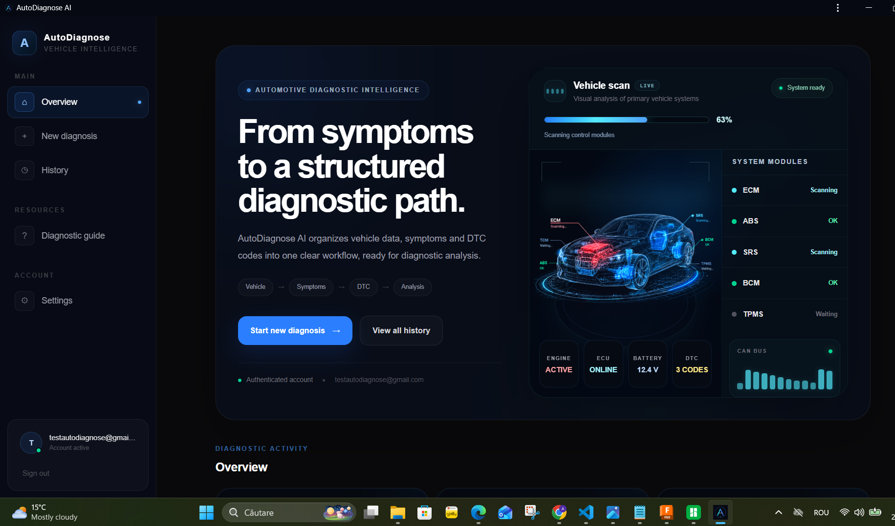
</p>

Diagnostic statistics are calculated from the user's stored cases.

<p align="center">
  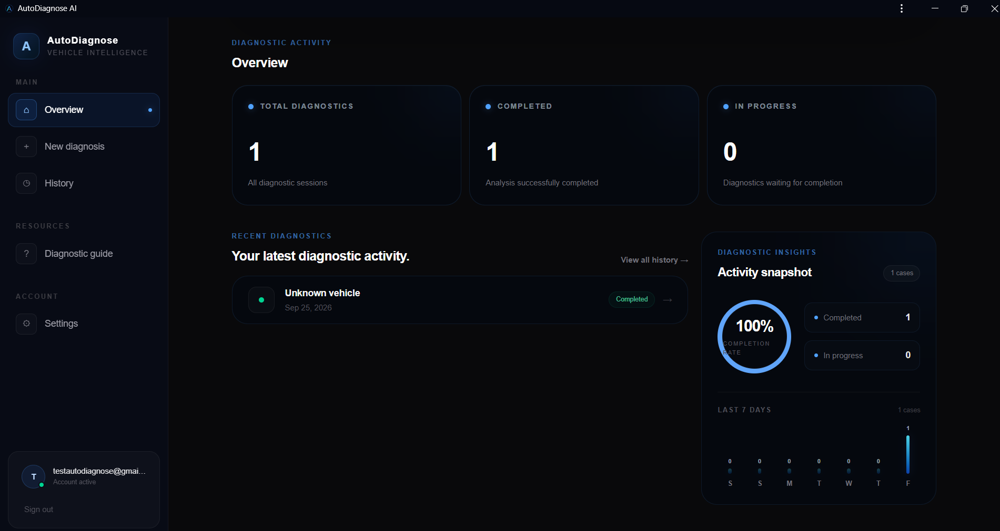
</p>

---

# Vehicle Identification

The first stage of the diagnostic workflow is vehicle identification.

Users can browse a structured vehicle library, search by manufacturer or model and select a vehicle family before entering vehicle-specific information.

<p align="center">
  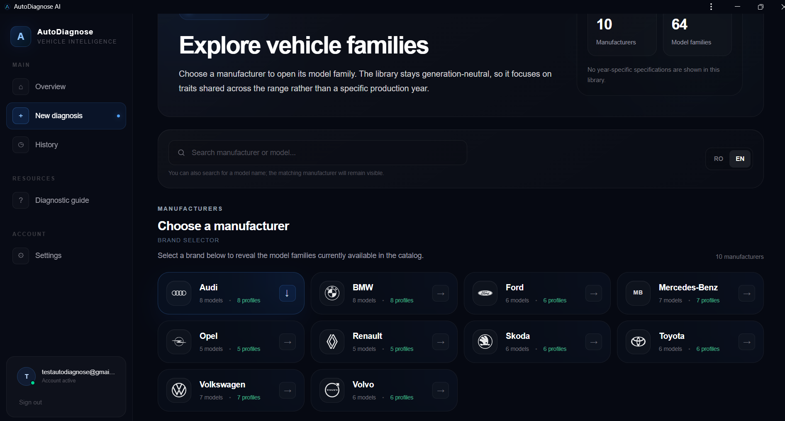
</p>

## Vehicle model library

Model families include visual identification, common traits and structured catalog information.

<p align="center">
  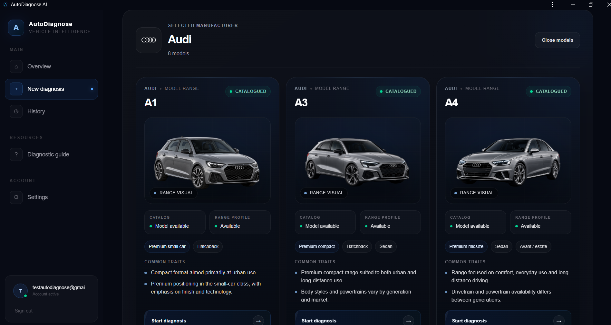
</p>

The catalog is intentionally generation-neutral where verified year-specific information is not available.

The interface clearly distinguishes between:

- manufacturer
- model family
- vehicle profile
- specific vehicle information
- verified and unverified information

---

## Specific vehicle information

After selecting the model family, the user can specify:

- production year
- fuel type
- engine information
- transmission
- drivetrain
- modifications
- recent repairs
- other diagnostic context

<p align="center">
  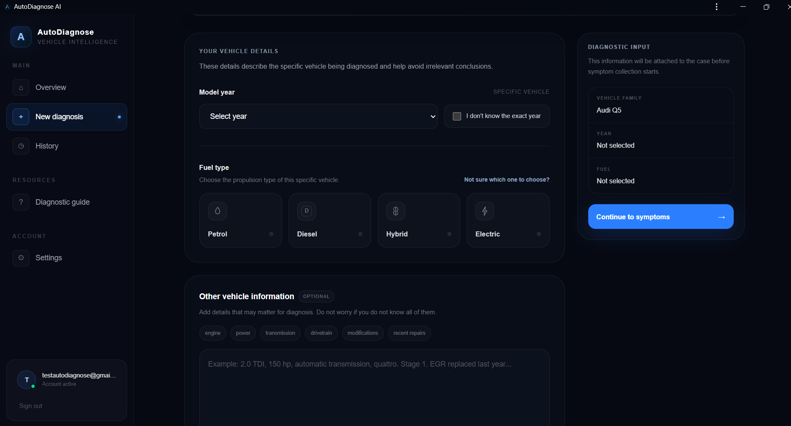
</p>

Unknown information can be skipped so that the application remains usable by users with different levels of automotive knowledge.

---

# Symptom Collection

The diagnostic workflow supports structured symptom intake.

Users can choose the closest symptom category and add their own description.

Supported symptom categories include examples such as:

- loss of power / poor acceleration
- starting or engine-running problems
- unusual noise or vibration
- smoke or unusual smell
- dashboard warning lights
- braking or steering problems
- overheating / temperature issues
- other vehicle behavior

OBD-II / DTC codes can also be supplied as additional evidence.

<p align="center">
  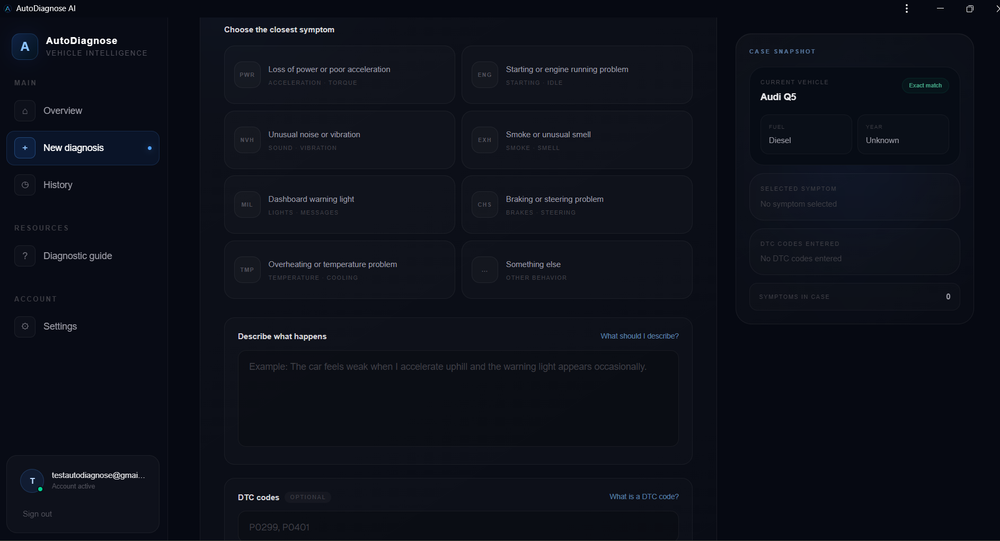
</p>

---

# Adaptive Diagnostic Questions

AutoDiagnose AI asks targeted follow-up questions based on the reported symptom.

Examples include:

- how the problem started
- how often it occurs
- whether vehicle performance changed
- under which conditions it appears
- whether a warning light is present

Users may also select **I don't know / I'm not sure**, allowing the diagnostic process to continue without forcing uncertain information.

<p align="center">
  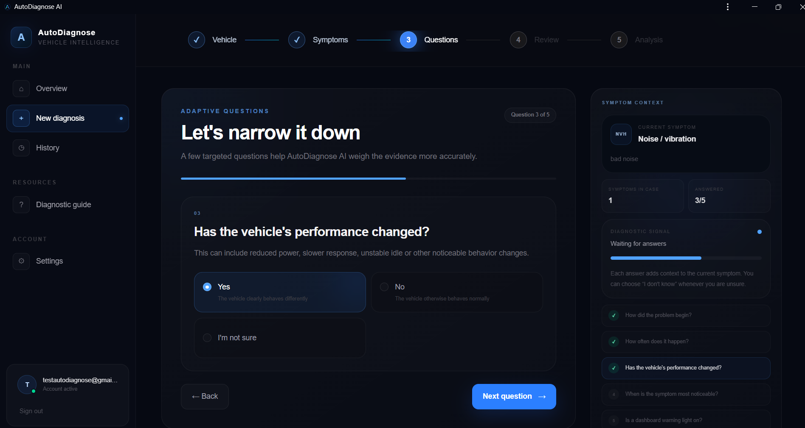
</p>

Each answer becomes additional diagnostic evidence.

---

# Multi-Symptom Cases

A case is not limited to a single problem.

After finishing one symptom, users can:

- add another symptom
- retain previous answers
- keep associated DTC codes
- continue until all reported problems have been captured

<p align="center">
  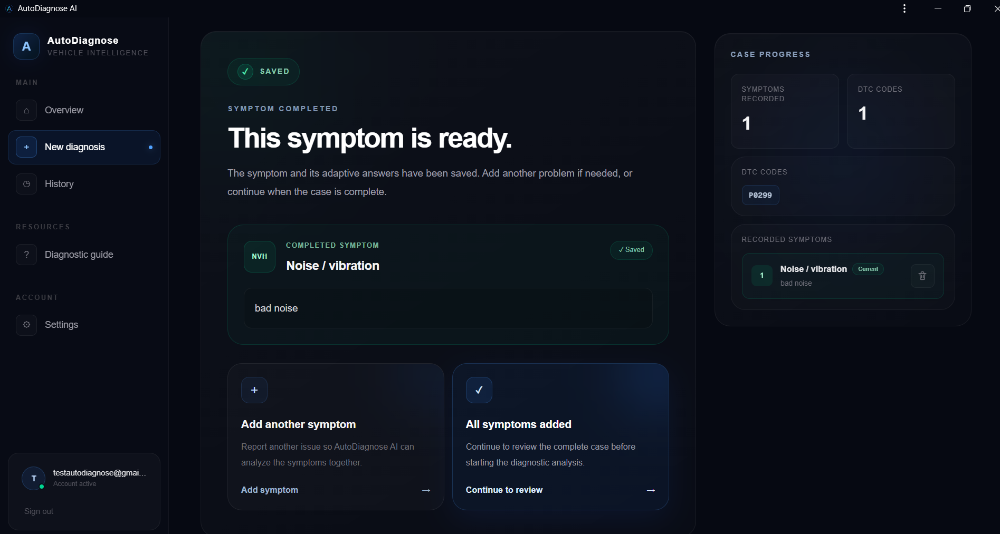
</p>

This allows the diagnostic engine to consider several related signals inside the same case.

---

# Case Verification

Before analysis starts, AutoDiagnose AI presents a complete case verification screen.

The user can review:

- vehicle profile
- fuel type
- year
- symptoms
- adaptive answers
- DTC evidence
- number of available diagnostic signals

<p align="center">
  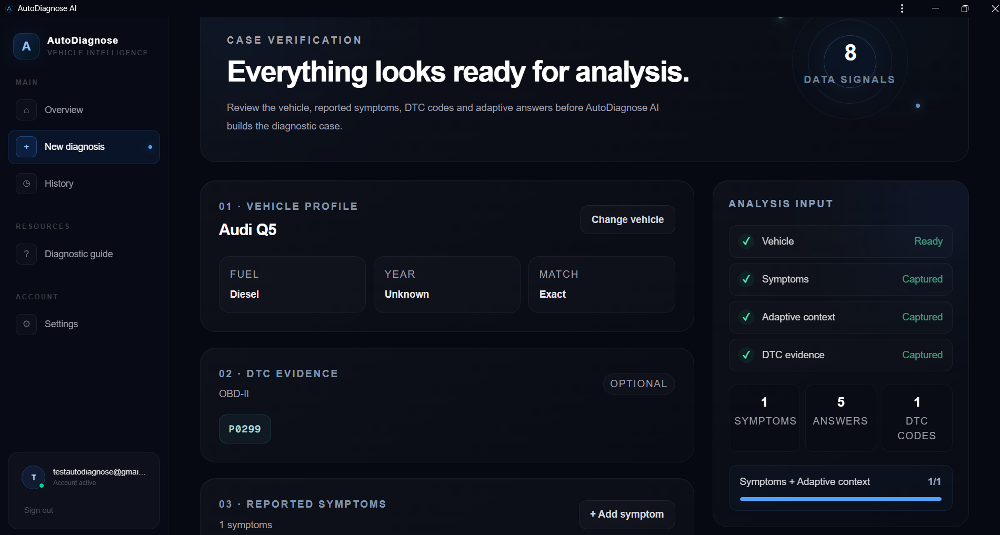
</p>

This step helps prevent incorrect analysis caused by accidental or incomplete input.

---

# Diagnostic Engine

The diagnostic engine evaluates the available case evidence and ranks possible causes.

The current architecture uses structured diagnostic rules, evidence weighting and confidence / relevance scoring.

A diagnostic result may consider:

```text
Vehicle data
+
Reported symptoms
+
Free-text evidence
+
DTC codes
+
Adaptive answers
+
Known diagnostic relationships
```

The engine does not simply return a single answer.

Instead, it produces:

- a primary hypothesis
- alternative hypotheses
- relevance scores
- evidence strength
- severity
- urgency
- recommended checks
- technical traceability

---

# Primary Diagnostic Result

The main result presents the strongest current hypothesis.

<p align="center">
  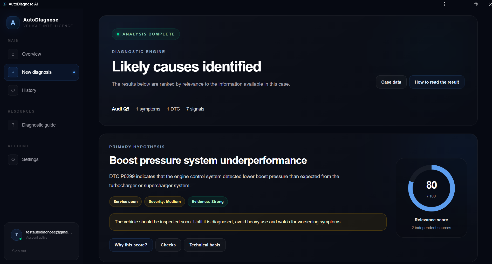
</p>

A result includes information such as:

```text
Primary hypothesis
Relevance score
Severity
Urgency
Evidence strength
Safety guidance
Evidence source count
```

Example:

```text
Boost pressure system underperformance
DTC: P0299
Relevance: 80 / 100
Severity: Medium
Urgency: Service soon
Evidence: Strong
```

---

# Ranked Possible Causes

AutoDiagnose AI does not treat one hypothesis as automatically confirmed.

Other possible causes remain visible and ranked by relevance.

<p align="center">
  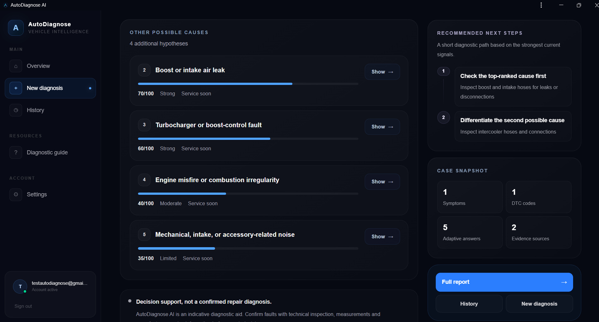
</p>

This supports a diagnostic mindset based on comparison and verification rather than replacing inspection with a single generated answer.

---

# Explainable Scoring

A core objective of AutoDiagnose AI is to keep diagnostic scores understandable.

Users can open the score explanation and see which signals affected the result.

<p align="center">
  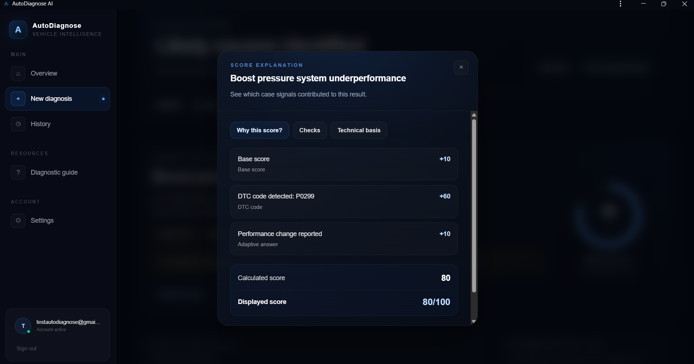
</p>

For example:

```text
Base score                   +10
DTC P0299 detected           +60
Performance change reported  +10
--------------------------------
Calculated score              80
Displayed score              80 / 100
```

The exact scoring depends on the diagnostic rule and available case evidence.

This makes the result more transparent than presenting an unexplained confidence value.

---

# Recommended Checks

Each hypothesis can include a structured sequence of checks that can help validate or eliminate it.

<p align="center">
  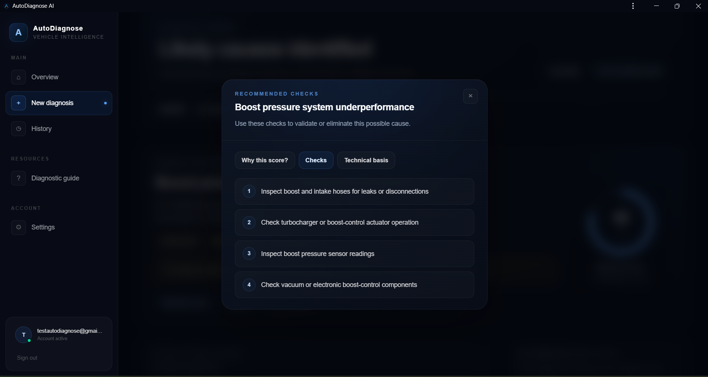
</p>

For a boost-pressure-related case, example checks may include:

1. inspect boost and intake hoses
2. verify turbocharger / boost-control operation
3. inspect boost-pressure sensor readings
4. inspect vacuum or electronic boost-control components

The application deliberately presents these as **checks**, not confirmed repairs.

---

# Technical Traceability

Diagnostic results can be traced back to the underlying rule and technical evidence.

<p align="center">
  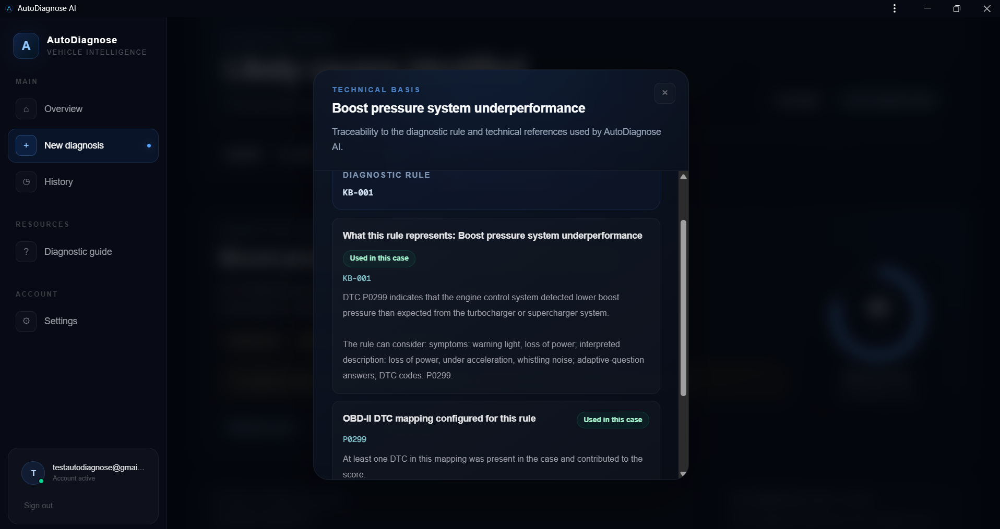
</p>

A technical basis can include:

- diagnostic rule ID
- rule description
- relevant symptoms
- DTC mapping
- adaptive-question evidence
- interpreted case evidence
- whether a particular rule was used in the case

Example rule identifier:

```text
KB-001
```

This architecture is designed so diagnostic logic remains inspectable and can later be extended with larger verified knowledge sources.

---

# Diagnostic Report

Completed analyses can be converted into a structured diagnostic report.

<p align="center">
  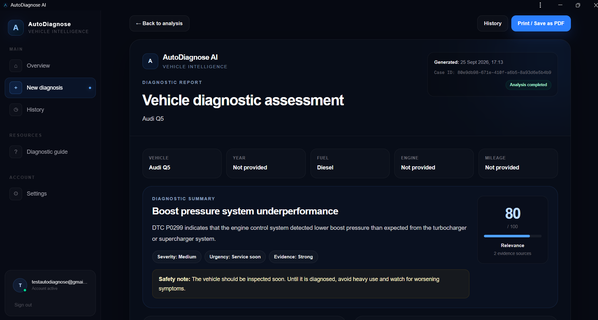
</p>

The report contains:

- vehicle information
- diagnostic summary
- primary hypothesis
- relevance score
- severity
- urgency
- evidence strength
- safety note
- reported symptoms
- DTC evidence
- recommended checks
- alternative hypotheses
- technical traceability

---

## Print / Save as PDF

Reports are formatted for printing and PDF export.

<p align="center">
  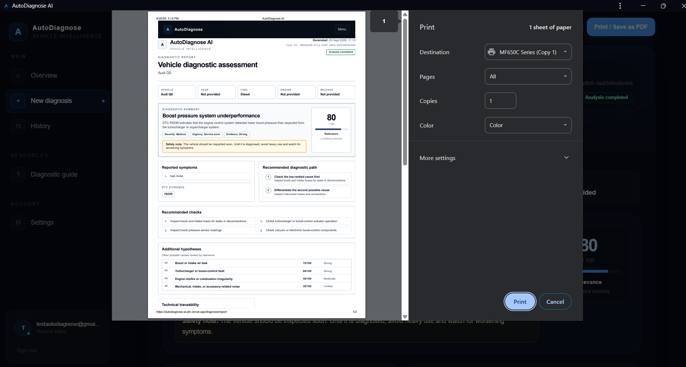
</p>

This allows a user to preserve or share a diagnostic assessment outside the application.

---

# Diagnostic History

Authenticated users have their own persistent diagnostic history.

Cases can be searched, reopened and reviewed without restarting the diagnostic process.

<p align="center">
  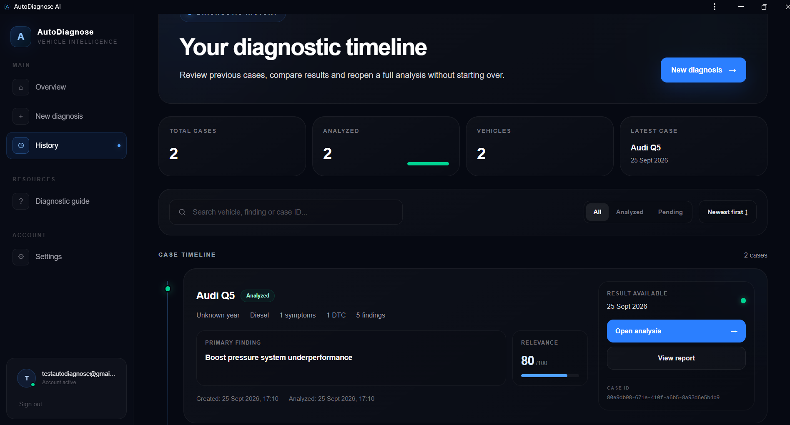
</p>

Stored case information includes:

- vehicle
- case date
- status
- number of symptoms
- number of DTC codes
- number of findings
- primary finding
- relevance score
- analysis timestamp
- report access

---

# Diagnostic Guide

AutoDiagnose AI includes an educational diagnostic guide.

It explains concepts such as:

- relevance score
- severity
- urgency
- evidence strength
- evidence sources

<p align="center">
  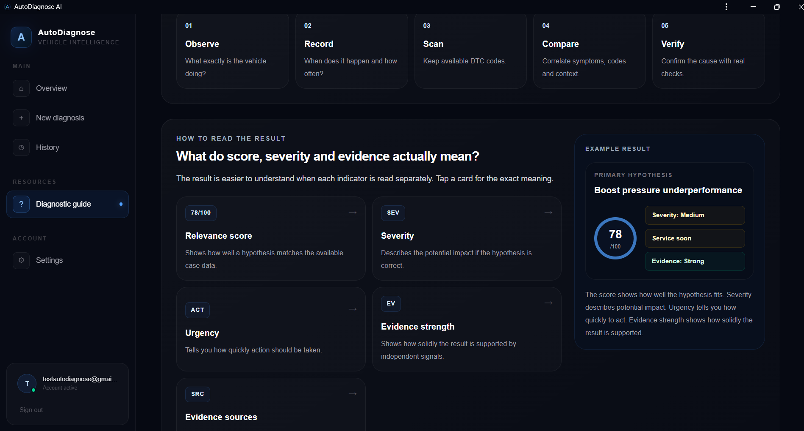
</p>

The guide also includes reference sections for:

- warning lights
- OBD-II / DTC codes
- symptom descriptions
- noise and vibration
- temperature and fluids
- battery and electrical systems

<p align="center">
  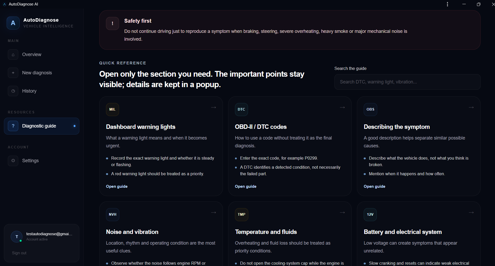
</p>

Safety guidance is deliberately highlighted throughout the platform.

---

# Privacy and User Data

The project includes privacy and personal-data controls as part of the product architecture.

<p align="center">
  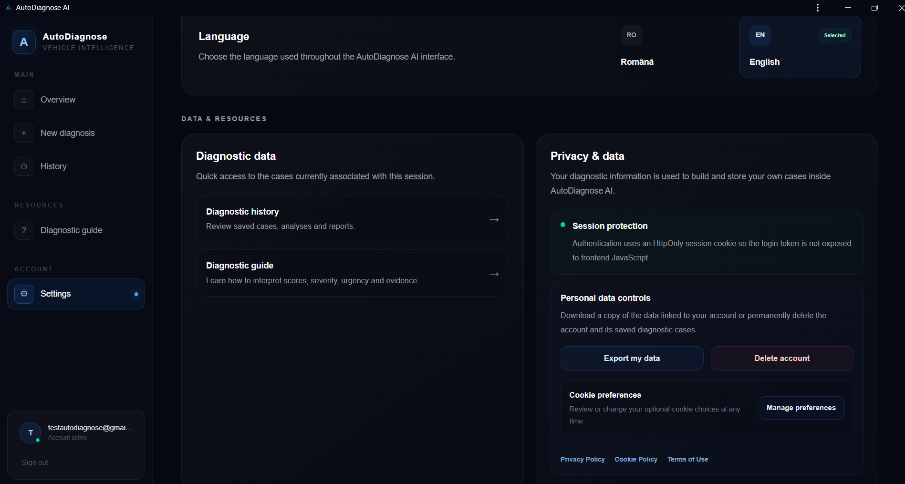
</p>

Authenticated users can:

- export their stored account data
- permanently delete their account
- delete associated diagnostic data
- manage cookie preferences
- access Privacy Policy
- access Cookie Policy
- access Terms of Use

Authentication uses HttpOnly session cookies so that session tokens are not directly exposed to frontend JavaScript.

> Legal text included in the project is implementation-level material for this portfolio project and should receive professional legal review before commercial deployment.

---

# Demo Account Notice

Some screenshots in this README display an email address such as:

```text
testautodiagnose@gmail...
```

This is a **demo/test account created exclusively for development and portfolio presentation**.

It does not represent a real customer, production user or private personal dataset.

---

# Guest Mode

The platform can also be used without creating an account.

Guest users receive a separate guest session.

Diagnostic cases created during that session are associated with:

```text
guest_session_id
```

Authenticated diagnostic cases are associated with:

```text
user_id
```

When a guest later registers or signs in, eligible guest diagnostic cases can be transferred to the authenticated account.

---

# Authentication Architecture

The platform implements:

- user registration
- user login
- logout
- session lookup
- Argon2 password hashing
- HttpOnly session cookies
- secure production cookies
- separate guest and authenticated sessions
- session persistence
- ownership validation

Passwords are never stored in plain text.

---

# Data Isolation

Each diagnostic case belongs to either:

```text
user_id
```

or:

```text
guest_session_id
```

This allows the backend to isolate diagnostic data between users and browser sessions.

---

# Progressive Web App

AutoDiagnose AI is installable as a Progressive Web App.

The project includes:

```text
Web App Manifest
Service Worker
PWA Icons
Apple Touch Icon
Standalone display mode
HTTPS production deployment
```

The service worker intentionally avoids aggressive caching of authenticated or diagnostic API data.

The production application can therefore be installed on supported desktop and mobile browsers while maintaining a browser-based deployment architecture.

---

# Bilingual Interface

AutoDiagnose AI supports:

```text
English
Romanian
```

Language selection occurs before the main application flow.

The chosen language is persisted locally and reused across the interface.

---

# Technology Stack

## Frontend

```text
Next.js 16
React 19
TypeScript
Tailwind CSS
Motion
Progressive Web App
```

The frontend handles:

- application routing
- diagnostic workflow UI
- authentication screens
- dashboards
- vehicle catalog
- case creation
- analysis presentation
- reports
- responsive design
- cookie controls
- PWA functionality

---

## Backend

```text
Python
FastAPI
Uvicorn
SQLAlchemy
Pydantic
Alembic
pwdlib / Argon2
```

The backend handles:

- REST API
- authentication
- session management
- guest sessions
- ownership
- diagnostic cases
- diagnostic analysis
- history
- account data export
- account deletion
- database access
- production configuration

---

## Database

```text
PostgreSQL 17
Neon PostgreSQL
SQLAlchemy ORM
Alembic migrations
```

Main persisted entities include:

```text
users
auth_sessions
guest_sessions
diagnostic_cases
```

Diagnostic cases may store:

- vehicle information
- symptoms
- DTC codes
- adaptive answers
- status
- analysis results
- timestamps
- ownership information

---

# Production Infrastructure

AutoDiagnose AI currently uses:

| Service | Purpose |
|---|---|
| Vercel | Next.js frontend |
| Render | FastAPI backend |
| Neon | PostgreSQL database |
| GitHub | Source control |

---

# Production Architecture

```text
                  ┌─────────────────────┐
                  │        USER         │
                  │ Browser / PWA       │
                  └──────────┬──────────┘
                             │
                             │ HTTPS
                             ▼
                  ┌─────────────────────┐
                  │       VERCEL        │
                  │  Next.js Frontend   │
                  └──────────┬──────────┘
                             │
                             │ REST API
                             │ credentials: include
                             ▼
                  ┌─────────────────────┐
                  │       RENDER        │
                  │   FastAPI Backend   │
                  └──────────┬──────────┘
                             │
                             │ SQLAlchemy
                             ▼
                  ┌─────────────────────┐
                  │        NEON         │
                  │ PostgreSQL Database │
                  └─────────────────────┘
```

---

# Diagnostic Architecture

The diagnostic system separates application logic from presentation.

A simplified architecture is:

```text
User Input
   │
   ├── Vehicle
   ├── Symptoms
   ├── DTC Codes
   └── Adaptive Answers
   │
   ▼
Input Validation
   │
   ▼
Evidence Extraction
   │
   ▼
Diagnostic Rules
   │
   ▼
Evidence Weighting
   │
   ▼
Relevance Scoring
   │
   ▼
Ranked Findings
   │
   ├── Severity
   ├── Urgency
   ├── Evidence Strength
   ├── Recommended Checks
   └── Technical Basis
   │
   ▼
Diagnostic Report
```

---

# AI and Diagnostic Strategy

The project is designed around a hybrid diagnostic architecture.

The objective is not to let a language model freely invent automotive conclusions.

Instead, the architecture separates:

### Structured diagnostic logic

Responsible for:

- deterministic rules
- known DTC relationships
- scoring
- evidence weighting
- severity
- urgency
- traceability

### AI / NLP components

Designed to assist with tasks such as:

- interpreting user symptom descriptions
- extracting useful evidence from natural language
- understanding automotive phrases
- converting unstructured descriptions into structured diagnostic signals
- generating clearer user-facing explanations

This separation allows AI capabilities to be expanded while keeping critical diagnostic reasoning inspectable.

---

# Confidence / Relevance Scoring

A diagnostic finding receives a relevance score based on available evidence.

Possible evidence sources include:

```text
Base rule weight
DTC evidence
Symptom category
Adaptive answers
Vehicle context
Extracted textual evidence
Multiple independent signals
```

The score expresses how strongly a hypothesis matches the available case information.

It does **not** represent a guarantee that the component is defective.

---

# OBD-II / DTC Support

Users can provide known diagnostic trouble codes.

Example:

```text
P0299
```

DTC evidence can significantly influence the diagnostic ranking when a code is mapped to a relevant diagnostic rule.

However, AutoDiagnose AI deliberately treats a DTC as evidence of a detected condition rather than automatically assuming that the named component must be replaced.

---

# Safety-Oriented Design

The application distinguishes between:

```text
Relevance
Severity
Urgency
Evidence strength
```

These represent different concepts.

For example, a hypothesis may have a strong match to the case but still require physical inspection before any repair decision is made.

Safety-oriented warnings are shown for situations involving areas such as:

- brakes
- steering
- severe overheating
- heavy smoke
- critical warning indicators
- major mechanical noise

---

# Environment Configuration

Example environment files are provided in the repository.

## Frontend

```text
frontend/.env.local.example
```

Example:

```env
NEXT_PUBLIC_API_BASE_URL=http://localhost:8000
```

For production:

```env
NEXT_PUBLIC_API_BASE_URL=https://your-api-domain.com
```

---

## Backend

```text
backend/.env.production.example
```

Important backend variables include:

```env
APP_ENV=production

FRONTEND_ORIGINS=https://your-frontend-domain.com

COOKIE_SECURE=true
COOKIE_SAMESITE=none

DATABASE_URL=postgresql://...
```

Never commit real:

```text
database passwords
API keys
session secrets
private credentials
production .env files
```

---

# Local Development

## Prerequisites

Recommended:

```text
Node.js
npm
Python
PostgreSQL
Git
```

---

## Clone the repository

```bash
git clone https://github.com/DumitriuAna23/autodiagnose-ai.git
cd autodiagnose-ai
```

---

# Frontend Setup

Move to the frontend directory:

```bash
cd frontend
```

Install dependencies:

```bash
npm install
```

Create:

```text
.env.local
```

Example:

```env
NEXT_PUBLIC_API_BASE_URL=http://localhost:8000
```

Start development mode:

```bash
npm run dev
```

Frontend:

```text
http://localhost:3000
```

---

# Backend Setup

Move to the backend directory:

```bash
cd backend
```

Create a virtual environment:

```bash
python -m venv .venv
```

Windows PowerShell:

```powershell
.\.venv\Scripts\Activate.ps1
```

Install dependencies:

```bash
python -m pip install -r requirements.txt
```

Start FastAPI:

```bash
uvicorn app.main:app --reload
```

Backend:

```text
http://localhost:8000
```

Swagger documentation:

```text
http://localhost:8000/docs
```

---

# Database Migrations

Database schema evolution is managed using Alembic.

Apply all migrations:

```bash
alembic upgrade head
```

Check the current migration:

```bash
alembic current
```

Main migration history includes schema changes for:

```text
diagnostic cases
users
auth sessions
user ownership
guest sessions
```

---

# Project Structure

A simplified repository structure:

```text
autodiagnose-ai/
│
├── backend/
│   ├── alembic/
│   │
│   ├── app/
│   │   ├── core/
│   │   ├── routers/
│   │   ├── models/
│   │   ├── schemas/
│   │   ├── diagnostic logic
│   │   ├── ownership logic
│   │   ├── config.py
│   │   └── main.py
│   │
│   ├── requirements.txt
│   └── .env.production.example
│
├── frontend/
│   ├── public/
│   │   ├── icons/
│   │   ├── ui/
│   │   └── sw.js
│   │
│   ├── src/
│   │   ├── app/
│   │   ├── components/
│   │   ├── data/
│   │   └── lib/
│   │
│   ├── .env.local.example
│   └── package.json
│
├── docs/
│   └── screenshots/
│
├── .gitignore
└── README.md
```

---

# Main Frontend Routes

The application includes routes such as:

```text
/
├── welcome
├── login
├── register
│
├── dashboard
│
├── diagnosis/
│   ├── vehicles
│   ├── vehicle
│   ├── symptoms
│   ├── questions
│   ├── symptom-complete
│   ├── review
│   ├── analysis
│   ├── report
│   └── history
│
├── guide
├── account / settings
├── privacy
├── cookies
└── terms
```

---

# Core Backend Capabilities

The backend includes endpoints and logic for areas such as:

```text
Authentication
Guest sessions
User sessions
Diagnostic case creation
Diagnostic case retrieval
Diagnostic analysis
Diagnostic history
Account data export
Account deletion
```

Examples of implemented account endpoints include:

```text
GET    /api/account/export
DELETE /api/account
```

Authentication routes include functionality for:

```text
register
login
logout
current session
```

---

# Database Ownership Model

Authenticated diagnostic cases:

```text
diagnostic_case.user_id
```

Guest diagnostic cases:

```text
diagnostic_case.guest_session_id
```

The backend resolves the current owner before returning private diagnostic data.

This enables multi-user behavior while preventing accidental cross-user history access.

---

# Privacy Architecture

The privacy-oriented implementation includes:

```text
HttpOnly session cookies
Secure production cookies
SameSite configuration
CORS allow-list
User data isolation
Account export
Account deletion
Cookie preferences
Privacy page
Cookie policy
Terms page
```

Production CORS is configured to accept only the intended frontend origin.

---

# Responsive Design

The interface was designed around a dark premium automotive visual system.

Design goals include:

- strong information hierarchy
- automotive HUD inspiration
- restrained animation
- high readability
- responsive layouts
- clear status indicators
- distinct safety messaging
- minimal neon effects
- modern technical appearance

The application adapts between desktop and mobile layouts.

---

# UI Design Language

Main visual tokens include:

```text
Background       #060912
Surfaces         #080D18
Raised surfaces  #0D1422
Primary text     #F5F7FA
Secondary text   #94A3B8
Metadata         #64748B

Action blue      #3B82F6
Cyan accent      #22D3EE
Success          #34D399
Warning          #FBBF24
Critical         #F87171
```

Typography uses the Geist family with monospaced presentation where appropriate for technical identifiers such as DTC codes and case IDs.

---

# Production Status

Current implementation status:

```text
Frontend deployment                Complete
Backend deployment                 Complete
Production PostgreSQL              Complete
Database migrations                Complete
Authentication                     Complete
Guest sessions                     Complete
User data isolation                Complete
Guest data transfer                Complete
Diagnostic history                 Complete
Privacy controls                   Complete
Cookie preferences                 Complete
Account export                     Complete
Account deletion                   Complete
Bilingual interface                Complete
Responsive design                  Complete
PWA installation                   Complete
Production CORS                    Complete
Secure production cookies          Complete
```

---

# Current Development Direction

Future development can include:

- larger verified DTC knowledge base
- manufacturer-specific technical datasets
- VIN decoding
- richer engine / drivetrain identification
- live OBD-II adapter integration
- real-time vehicle telemetry
- additional diagnostic rules
- expanded NLP evidence extraction
- improved LLM-assisted explanations
- automated integration tests
- unit tests for diagnostic rules
- monitoring and observability
- performance optimization
- custom production domain
- native mobile packaging
- cloud object storage for additional assets
- improved technical-reference management

---

# Engineering Objectives

AutoDiagnose AI was created to demonstrate experience across several areas of software engineering.

### Full-stack development

```text
Next.js
React
TypeScript
Python
FastAPI
PostgreSQL
```

### Backend engineering

```text
REST APIs
Authentication
Authorization
Database ORM
Migrations
Session management
Ownership isolation
Production configuration
```

### Diagnostic logic

```text
Structured evidence
Diagnostic rules
DTC mapping
Adaptive questioning
Confidence / relevance scoring
Ranked findings
Explainability
```

### Product engineering

```text
Responsive UI
PWA
Privacy controls
User accounts
Guest mode
Reports
History
Cloud deployment
```

### Automotive domain

```text
Vehicle identification
OBD-II
DTC interpretation
Symptoms
Diagnostic evidence
Repair-oriented checks
Safety guidance
```

---

# Security Notes

The repository intentionally excludes:

```text
.env
.env.*
Python virtual environments
node_modules
Next.js builds
local database backups
ZIP backups
production secrets
```

Only example environment configuration files are committed.

Production credentials are stored in the deployment platforms' environment-variable systems.

---

# Important Diagnostic Disclaimer

AutoDiagnose AI is an educational and software-engineering project.

The application provides decision support based on the information supplied by the user and the diagnostic logic available in the system.

Results represent **possible causes**, not confirmed mechanical diagnoses.

They should not be treated as a substitute for:

- professional vehicle inspection
- manufacturer repair documentation
- physical measurements
- qualified automotive technicians
- safety-critical repair procedures

A DTC identifies a detected condition and does not necessarily identify the failed component.

Safety-critical problems involving systems such as braking, steering, airbags, severe overheating or major mechanical faults should be evaluated by a qualified professional.

---

# Author

**Ana Maria Dumitriu**

Electrical Engineering and Computer Science student focused on automotive command and control systems.

Areas of interest:

```text
Software Development
Artificial Intelligence
Automotive Software
Embedded Systems
Vehicle Diagnostics
Full-Stack Development
3D / CAD Engineering
```

---

## Project Links

**Live application**

https://autodiagnose-ai-phi.vercel.app

**FastAPI documentation**

https://autodiagnose-ai-api.onrender.com/docs

**GitHub**

https://github.com/DumitriuAna23/autodiagnose-ai

---

<p align="center">
  <strong>AutoDiagnose AI</strong><br>
  Intelligent Automotive Diagnostics
</p>